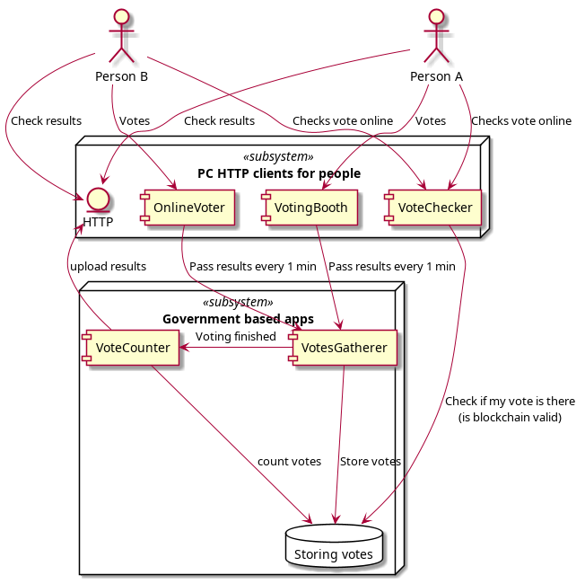
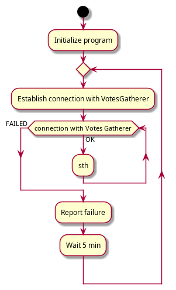

**Distributed voting system**
=============================

Project description
-------------------
Console based system which resembles microservices architecture and allows to perform secure and distributed voting.

Project goals
-------------

1. Uses Git as SCM
2. I want to learn C++17 ~~and C++20 quirks~~ ( C++17 has to be used because of Github Actions (Ubuntu 18.04))
3. ~~uses automake to build itself because I know CMake and I want to learn something new~~ autotools is the evilest thing ever. I don't want to touch it anymore
4. Favor std::future instead of std::thread
5. Favor TDD along with setting up race condition tests and memory leak tests
6. Provides interface that makes it easy to change communication mechanism (or even compare it). Let's play with ZeroMQ, **boost::asio chosen at first, but we don't need to dig so deep. I need a high level lib. Like ZeroMQ for example**
7. Uses abstract factory pattern and observer pattern
8. Does not use raw pointers but only std::unique_ptr and std::shared_ptr
9. ~~Uses Conan as package manager~~ project is too simple to use package manager ~~vcpkg has been used successfully as package manager. Just go to https://github.com/microsoft/vcpkg. It's really easy.~~
10. Doxygen will now not be used because I favor clean code practices. If the project grows significantly then the issue of code docs will be considered.

### Nice to have
1. Custom allocator (http://dmitrysoshnikov.com/compilers/writing-a-memory-allocator/)

Project setup
-------------

1. setup boost
sudo add-apt-repository ppa:mhier/libboost-latest
sudo apt-get update
sudo apt-get install
sudo apt-get install libboost1.70-dev
2. Next step (easier formatting)
3. No sudo needed for binding to sockets (UNIX resticts ports up to 1024 to root)

UMLs
-------------

## Component diagram

## Activity charts
### Voting booth chart

Contributing
------------

The repo is now considered as a proof of skills and something to kill the time during COVID-19 pandemic.

F.A.Q.
------

The current project will be developed according to [the Issues list](https://github.com/AeolusTech/Distributed-voting-system/issues)

License
-------

Distributed voting system specific code is distributed under MIT License.
